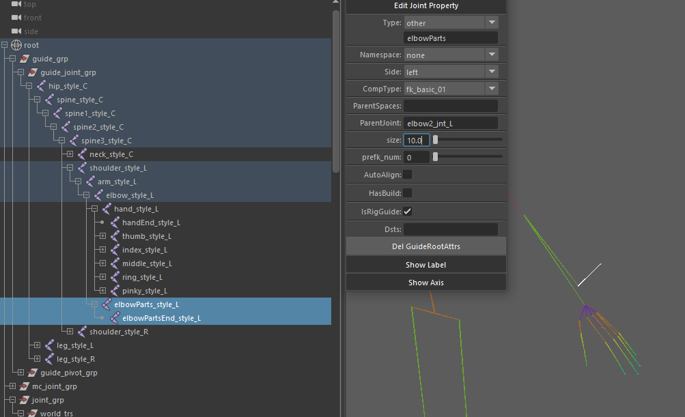

###**Advance Flow**
___

####1. カスタムの追加リグ、およびセカンダリーリグについて
テンプレート部分以外のリグについては、ビルド前、又はビルド後どちらでも大丈夫ですが、
Maya標準の骨をモデルに合わせ配置し、その骨に対しカスタムアトリビュートを追加することで生成可能です。
 
・例として、人間の前腕にパーツがついていて、それにFKリグを作成したいとします。
 
人テンプレをビルド後、画像のように骨を配置します。親となるスタイル骨がある場合はその子供にします。
ない場合は、親となる骨の生成元になったであろうスタイル骨の子供にします。
 
追加したジョイントチェーンを選択し、**Guide Editor**でアトリビュートを追加していきます。
 
 

 
 
elbowPartsはL、Rで一個だけなので、namespaceは「none」に設定、いくつもある場合は「A」「B」などを付けます。
L側なので、sideに「left」を設定、
FKを作成したいので、compTypeに「fk_basic_01」を指定します。
parentJointには親となるバインド骨「elbow2_jnt_L」を指定しています。
 
 
ジョイントチェーンのルート骨以外の骨は「part, ns, side, isRigGuide」のアトリビュートだけあればOKなので、ルート骨以下の骨を選び
**Guide Editor**の**Del GuideRootAttrs**で不要Attrを削除します。
 
アトリビュート追加が終わったら、guide_grp直下の骨をすべて選択し、再ビルドします。
ビルド済みのリグはスキップされ、追加した部分のみリグが生成されます。

