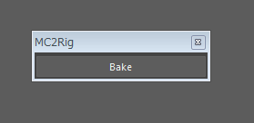

##**Anim**

####**モーキャプの読み込み**
1.rigのシーンを開いているか、リファレンスしている状態で、FBXのアニメーションをMC骨に読み込みます。 
　※FBXImport時のOptionやネームスペースなどは適時調整してください。

2.
ogRig2 > Animation > MC Bake Tool を立ち上げ、

MCToolUIウィンドウからベイク対象のリグを選択し、「bake mc->rig」にてベイクします。

 
 

___
####**ピッカー**
ogRig2 > Animation > Piker
IKからFK、またその逆に切り替えた際に、ポーズを保ったままキーを打ち直す機能が、手足のIKボタンを
右クリックすると使えます。
 
 

___
####**その他**
#####手足のIKのポールベクターについて  
    ・space  
    auto・・・IKCTLに追従  

#####手足のIKCTLについて  
    ・space
    local・・・手の場合、肩に追従。足の場合hipに追従
    arm(leg)Param_ctrl_L(R)にてスケールCTL、ベンドCTLなどの表示ができます。

#####背骨について  
    spineParam_ctrl_Cでストレッチの調整ができます。

<!---
**ogT → Bake MC -> Rig**で*MC2Rig*ウィンドウを立ち上げます。

MCルートジョイント（mc_hip1)を選択後、**Bake** ボタンを押し、MC骨のアニメーションをリグにベイクします。
--->

