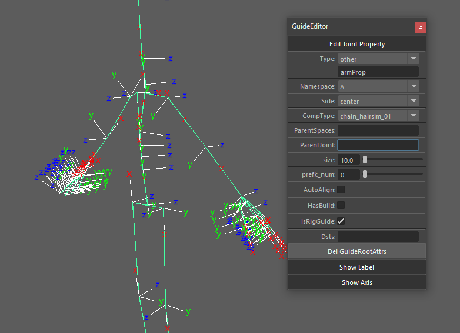

###Guide Editor

---

---
####**何のツール？**
スタイル骨にリグを生成するためのアトリビュートを追加、編集するツールです。
 
 

---
####**使い方**
骨を選択し、GUIの操作を行います。

Joint Property  |      |note
----------------|------|-------------------------------
**Type**        |必須  |基本となる部位名。テンプレ以外の骨はotherで任意の名前を設定します。
**Namespace**   |必須  |アクセ、髪の毛など、チェーンの本数が多いものはネームスペースA~Zを付けていきます。
**Side**        |必須  |center, left, rightのラベルを付けます。
**CompType**    |必須  |生成されるリグの種類を決めます。
**ParentSpaces**|必須  |骨のラベル表示を切り替えます。
**ParentJoint** |      |親となる骨をスタイル骨の親と変えたい時はここで指定。
**size**        |必須  |CTLの大きさ。
**prefk_num**   |     |chain_hairsim_*コンポーネントで使用。
**AutoAlign**   |必須  |あまり対応していないので、基本OFFで。
**HasBuild**    |必須  |OFFにしておく。
**IsRigGuide**  |必須  |ONにしておく。
**Dsts**        |      |fk_all_01コンポーネントで使用。

---
補助機能                |note
-----------            |-------------------------------
**Del GuideRootAttrs** |チェーンのルート以外には不要なアトリビュートを削除します。
**Show Label**         |骨のラベルの表示切替。
**Show Axis**          |骨の軸の表示切替。
