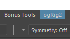
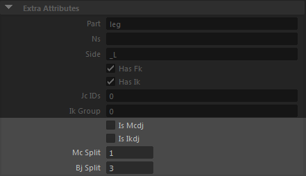
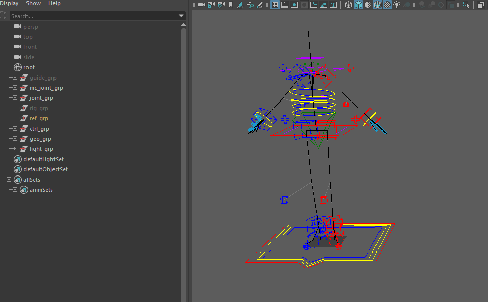

___
####**Tool設定 (Maya2016, 2016.5, 2017 対応)**
Maya起動バッチのモジュールパスに以下のパスを追加して起動すると、
Y:\devtools\MayaEnvDP\ogtools
画像のようなメニューが出てきます。

※ モジュールパスに旧ツールフォルダが登録されている人は削除してください。
旧ツールフォルダ： Y:\devtools\maya[version]\modules

___
####**== 準備 ==**
リグの生成時に大量のノード生成が行われますので、なるべくシーンが綺麗な状態で作業を始めて下さい。
理想的には新規シーンです。　　

モデルが存在した状態でリグを生成する時は、
モデルに"_geo"、マテリアルに"_MT"、テクスチャに"_TX"などの文字を尻に付けるなど、　　
名前で明確に区別できる状態にしておくのが良いかと思います。

___
####**1. スタイル調整**
**Rig Builder**から**ogAutoRig**を起動し、
**Import Style Template** でスタイルを読み込みます。

**+骨の位置合わせと軸の設定**  
骨の位置をモデルに合わせ調整したら、**[Joint Edit Tool](joint_edit.md)**や、
Maya標準機能のOrientJointツールなどを使いつつ、センターとL側の骨の軸の向きを設定します。
  
軸の向きは下の設定に合わせて下さい。
スタイル骨の初期設定がこの設定なので、よく分からない時は骨の軸を表示し、
それが初期設定と大体同じか確認してみて下さい。
  
part       |primary axis|up axis    |world up
-----------|------------|-----------|--------
root       |world       |world      |world
spine      |x+          |y+         |z-
neck       |x+          |y+         |z-
head       |x+          |y+         |z-
shoulder(L)|x+          |y+         |z-
arm(L)     |x+          |y+         |z-
hand(L)    |x+          |y+         |free
waist      |x+          |y+         |z-
leg(L)     |x+          |y+         |z-
foot(L)    |x+          |y+         |y-

※footパートはankle1から先の部分です。
※handパートはwrist1から先の部分で、worldUpは自由です。  
 
**+足のピボット**
軸設定が終わったら、足のピボット位置を設定して下さい。

locator             |役割            |調整方法
--------------------|---------------|----
leg_L_foot_piv_outer|IKの外側のピボット  |txのみで調整
leg_L_foot_piv_inner|IKの内側のピボット  |txのみで調整
leg_L_foot_piv_heel |IKの踵ピボット     |tzのみで調整
 
**+骨の分割数**
IKリグが作成されるパート(arm, leg)は骨を任意に分割できます。
パートのルート骨には次のアトリビュートがあるので、それぞれ設定して下さい。　　

Attr             |意味
-----------------|---------------
is_mcdj          |MC骨を２重間接にするか否か
is_ikdj          |IK骨を２重間接にするか否か
mc_split         |MC骨の分割数
bj_split         |バインド骨の分割数
※ splitを-1にセットすると、ウィンドウの split_dist スライダーの距離に応じて骨が分割されます。
 
**+スタイル骨のミラー**
L側の設定がすべて終わったら、ミラーリングしたい骨のルート（人型ならshoulder1_L, leg1_L）を選択し
**[Joint Edit Tool](joint_edit.md)**の**Mirror Joint**でミラーして下さい。
  

___
####**2. リグの生成**
ルートジョイント（hip1)を選択、**Build Rig** ボタンを押し、リグを生成します。
完了すると、このようなリグと階層が作成されます。

  
___
####**3. MCからリグへのベイク**
ベイクしたいリグのmc骨をどれか一つ選択し、「Bake」ボタンを押すとリグにキーがベイクされます。
複数のリグの骨を選択すれば、複数のリグを一括で処理できます。

<!---
**ogT → Bake MC -> Rig**で*MC2Rig*ウィンドウを立ち上げます。

MCルートジョイント（mc_hip1)を選択後、**Bake** ボタンを押し、MC骨のアニメーションをリグにベイクします。
--->

