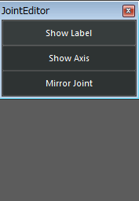

###Joint　Edit Tool

####**使い方**
骨を選択し、GUIの操作を行います。

gui            |note
-----------    |-------------------------------
**ShowLabel**  |骨のラベル表示を切り替えます。
**ShowAxis**   |骨の軸表示を切り替えます。
**MirrorJoint**|骨を反転します。付随する属性なども反転します。

<!---
gui            |note
-----------    |-------------------------------
~~Type~~       |~~骨が属するパートを設定します。~~
~~Namespace~~  |~~今の所すべてnoneで。~~
~~Side~~       |~~骨が属する位置を決めます。root, waist, spine, neck, headはcenter, shoulder, arm, hand, legはleftかright~~
~~RigType~~    |~~生成されるリグの種類を決めます。~~
**ShowLabel**  |骨のラベル表示を切り替えます。
**ShowAxis**   |骨の軸表示を切り替えます。
**MirrorJoint**|骨を反転します。付随する属性なども反転します。
--->