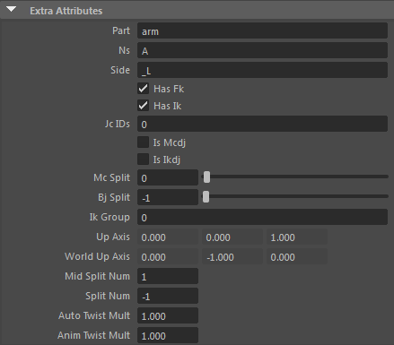

###**Joint Attribute**
___

####1. 全ての骨に必須  
-  **_part $string**  
モジュールの種類。  
arm: IK必須、IK_endに回転のglobal、local切り替え追加。  
leg: IK必須、riverseFoot追加、poleVectorの挙動がleg仕様。  
head: global、local切り替え追加。  
- **_side $string[_L|_R|]**  
_L、_R、又は値無しの何れかにセットする事。  
IKの生成に影響する。  
- **_ns $string**  
part、sideが同一のモジュールを複数定義したい場合は_nsによってそれぞれが  
一意のモジュール名になるようにする。  
- **has_fk $bool**  
モジュールがFKを生成するか否か。  
- **has_ik $bool**  
モジュールがIKを生成するか否か。  
- **jcIDs $string[0, 1, 2...]**  
モジュール内のジョイントチェーンを識別するID。handモジュールなど、複数のジョイントチェーンを持つものは
チェーン毎にIDを振り分ける事。  
※例、handモジュールのjcID  

	| chain  | ID |
|--------|----|
| thumb  |  0 |
| index  |  1 |
| middle |  2 |
| ring   |  3 |
| pinky  |  4 |

####2. IK骨に必須  
- **ik_group $string[0, 1, 2...]**  
IKリグの固まり。legモジュールは3つのIKから成るが、ik_groupは1つである。

####3. ik joint chainのルートに必須  
- **is_mcdj $bool**  
MC骨を2重関節にするか否か。  
- **is_ikdj $bool**  
骨を2重関節にするか否か。
- **mc_split $int[-1 < value]**  
MC骨の分割数。
-1でUIのsplit又はsplit_distにより決定される。
- **bj_split $int[-1 < value]**  
骨の分割数。
-1でUIのsplit又はsplit_distにより決定される。
- **upAxis $vector**  
IKのUp軸。
- **worldUpAxis $vector**  
IKのworldUp方向。

