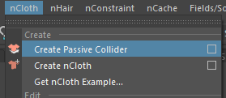

###**ogSim**
___
###**何のツール？**
プリセットを基にショットワークでhairsimを行うツールです。  
ogRig2 > Utilities > ogSim で起動します。  

___
---
###**プリセットについて**
#####AssetPreset  
    Simで揺らしたいFKチェーンの情報をまとめた物で、基本的にはアセット別に用意します。  
    Simの1個のかたまりであるpartを作成し、それに対しFKチェーンを登録していきます。  

#####SimPreset  
    hairsimの設定。hairSystemノードのアトリビュートプリセットです。  
    案件をまたいで使いまわしたり、カット単位で作ったり、自分用のものを作ったりします。  

___
###**大まかな流れ**
1. **AssetPreset、SimPresetの作成**  
プロジェクトのRigger、AnimSVなどが各キャラ分用意します。
<br>

2. **プリセットのロード**  
AssetPreset、SimPresetのルートフォルダを指定し、プリセットを読み込みます。  

```
    ※下記環境変数にそれぞれのフォルダをセットしておくと、そちらを自動的に見に行きます。  
    OGSIM_ASSET_PRESET_DIR  
    OGSIM_SIM_PRESET_DIR  
```
<br>

3. **SimRigの作成**  
Asset、Namespaceをセットし、Partを一つ以上選択します。  
下部の**Do > Create Sim Rig**にて生成します。  
<br>

4. **ベイク**  
hairsimの調整が終わったらPartを選び、**Do > Bake Sim**にてFKにベイクします。  
問題なければ**Do > Delete Sim Rig**にてSimRigを削除してください。  
やっぱSimをやり直す場合は、**Do > Reconnect**にて、再度SimRigとFKをコネクトしてください。  

<br>
___
###**GUI説明**

#####File  
    Set Asset Preset Dir ・・・ AssetPresetが入ったフォルダを指定し、プリセットを読み込みます。  
    Set Sim Preset Dir ・・・ SimPresetが入ったフォルダを指定し、プリセットを読み込みます。  

    Save Asset Preset ・・・ 現在のAssetPresetをファイルに書き出します。  
    Save Sim Preset ・・・ 現在選択しているhairSystemのアトリビュートをファイルに書き出します。  

#####Mode
    Simモード、編集モードを切り替えます。  

<br>
####Simモード  


   Simモードでは、AssetPresetの新規作成及び、作成したAssetPresetやSimPresetを読み込んで、Simリグの作成、ベイク、削除などを行います。  

  - **AssetPresetの新規作成**  
    Assetコンボボックスの左の方をダブルクリックし、編集できる状態にしたらプリセットの名前を入力します。  
    Enterを押すと確定し、追加されます。  
    Editモードに移行し、FKチェーンの追加を行って下さい。

  - **AssetPresetの使用方法**  
    Asset、Namespaceを選択すると、Partが表示されます。  
    基本的な操作は、Partを選択し、Doボタンから実行したいタスクを選択する流れになります。  
    シーン内に作成済みのSimRigがある場合、Partの背景色が青色に表示されます。  

#####Simの調整  
    SimRigが生成済みの場合、Partを選択すると対応したhairSystemノードが選択されるので、Simの調整はAttributeEditorで
    行ってください。


<br>
####Editモード  

  Editモードでは、現在のAssetPresetを編集します。  
  Partの追加、削除、PartへのFKチェーンの登録、削除を行えます。  

  - **AssetPresetの編集方法**  
    予めSimモードで編集したいAssetPresetを選択しておきます。  
    編集モードに切り替え、左のpartリストを右クリックし、part名を入力し追加します。  

    partを選択し、partに登録したいFKチェーンを親から一番下の子まで選択し、右のfkリストで右クリックしAddします。  
    これをチェーンの数分繰り返します。  
    終わったら File > Save Asset Preset で書き出します。  

  - **FKチェーンの選択**  
    fkリストを選択すると、実際にFKチェーンが選択されます。  

<br>
___
###**Sim Tips**

<br>
  - **動きの調整**  
    ogSim > Sim mode で Partを選択すると、hairSystemが選択されます。  
    AttributeEditorで、図の部分を主に調整します。  

  
    **Start Curve Attract** ・・・ 元の形状をどれだけキープするか。  
    **Attraction Scale** ・・・ 根元から毛先にかけてのキープ具合。基本的には根元高め、毛先弱め。  
    **Drag** ・・・ 上げると急な動きに振り回されづらくなります。  
    **Damp** ・・・ 上げると動きが止まりやすくなります。  

<br>
  - **重力**  
    hairSystemをAttributeEditorで開き、タブを右に送っていくと**nucleus**がいます。  
    これの**gravity**を調整して下さい。  

  

<br>
  - **コリジョンの追加方法**  
    コリジョンモデル用として適当なサイズのCubeやSphereを作成し、体の骨（垂れ物の骨はNG）にコンストレインします。
    コリジョンモデルを選択し、**nCloth > Create Passive Collider**のオプションを開き、
    コリジョンさせたい**ncleus**を選択し、実行します。  

  
    **nRigid**というノードが作成されるので、AttributeEditorにて**Solver Display > Collision Thickness**
    のように変更し、再生時にコリジョンの厚みが表示されるようにします。  
    必要に応じて、**Thickness(厚み)**も調整します。  

  
    ogSim > Sim mode で Partを選択すると、hairSystemが選択されます。  
    AttributeEditorで、**Solver Display > Collision Thickness** に設定。  
    **Hair Width**＝コリジョンの厚みを調整します。細すぎると貫通してしまうので、太めに設定します。  
    基本的には、根元が細く、毛先に行くにしたがって太くしておくのが良いです。  
    
  
